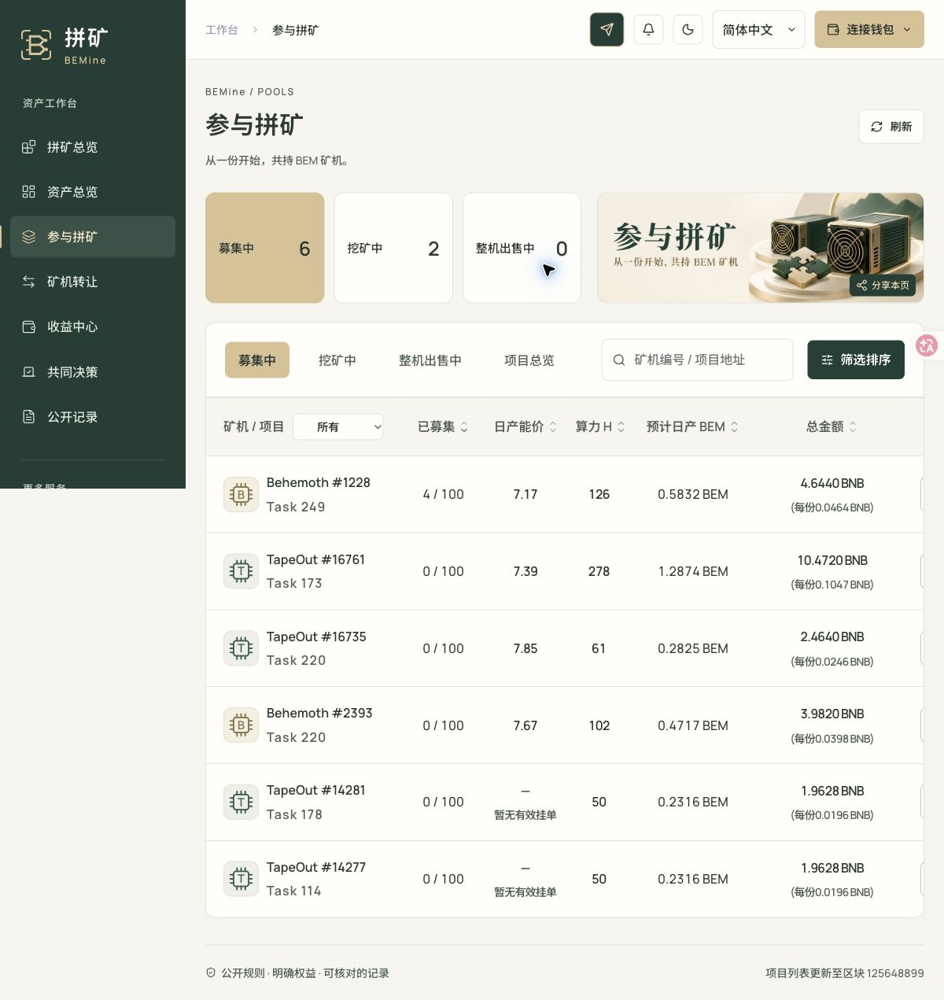

# 官网挂单日产能价显示修复（2026-10-04）

正式网页已发布，运行前端源码为 `80e754215a41e6ab627eda58a050b3b807c551cf`。原正式前端为 `b61a835a50ba876ddcd3f046ad2160d3041ec266`。正式入口为 https://bemine.cc.cd/#pools 。

参与拼矿列表此前只从 Firsto 订单提取矿机售价。即使矿机预计日产量已读取，只有官网有效挂单的矿机也可能缺少日产能价。修复后，募集项目使用当前有效官网挂单价除以该矿机预计日产出；官网无有效挂单时，仅允许同 NFT、当前卖方仍持有且未过期的 Firsto 卖单作为后备。不会把募集总额、购机上限、历史直售约定或全市场参考价当作当前卖价。

官网价读取仅在项目大厅和详情的 Funding/Funded 项目启用。先验证官方矿机身份和正数 BEM 日产量，才读取 ownerOf 与 listingFor。其他持仓、收益和份额市场不增加官网卖价查询。失败保留已验证日产，区别显示“暂无有效挂单”与“价格暂不可用”；不沿用旧官网价。

请求保持五分钟缓存、并发去重及手动重试最少十秒间隔。30 秒页面更新复用仍有效的报价。缓存新增模式和身份标记，并升级到 v3，防止旧的缺价记录遮住新读取结果。严格模式复用最终已核验区块的 NFT owner，并在该区块读卖单，保留链与区块规范性检查。

## 验证

- 53 项聚焦测试与 1225 项前端测试通过；目录、币价、平台规则和 ABI 同步检查通过，生产静态构建成功，独立复核通过。
- 发布后实际浏览器确认 TapeOut #16761 显示 7.39、Behemoth #2393 显示 7.67，价格来源提示为当前官网挂单；其他有效 Firsto 卖单继续显示其价格。
- TapeOut #14281、#14277 在只读核查时，当前配置官方市场 listingFor 返回 id=0、price=0、valid=false，且页面没有有效 Firsto 后备。页面因此明确显示“暂无有效挂单”，同时保留 0.2316 BEM 的预计日产。该状态不能单独证明矿机已被买走，也不触发下架或退款。
- 前端原子切换，保留旧不可变资源和回滚目录。九个生产服务的运行绑定和源码、部署 manifest、nginx 与合约升级页面均未变化。未签名或发起任何链上交易。

发布回执、浏览器单元格及来源提示、只读卖单证据、测试摘要和截图均在本目录。截图来自正式页面，未修改显示内容。

