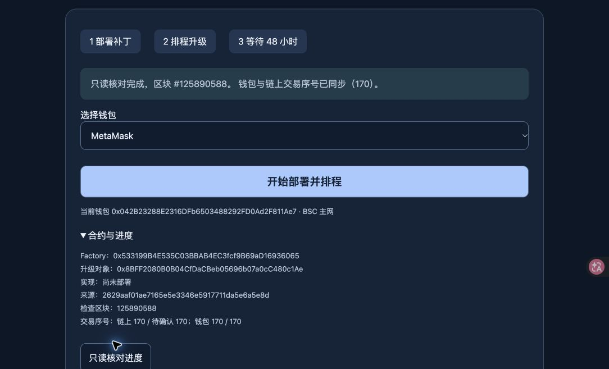

# Portfolio signing entry nonce synchronization

The signing entry used to compare two concurrent floating `latest` / `pending`
wallet reads and label every difference or invalid value as another pending
transaction. This also rejected a stale wallet view after an earlier transaction
had already mined. It could stop the workflow before requesting a signature.

The entry now reads the independent node's confirmed nonce at an explicit block,
reads its pending nonce, verifies the same block hash after the reads, and uses
that nonce only when the independent pending nonce matches and both wallet views
do not lead it. If a transaction mines between reads or a node is behind, up to
three fresh proofs are attempted. Persistent pending, malformed responses and
unsynchronized nodes have separate messages. The UI exposes the observed values
in the existing read-only progress panel.

An original uncertain/submitted journal intent must still be recovered from its
original transaction before any nonce proof or new request. Already confirmed
nonces cannot be reused. No max-nonce selection, automatic transaction replacement,
private-key use or signing is added. The exact candidate config, journal key,
contract bytecode, constructor, upgrade salt and waiting period remain unchanged.

The deployed dedicated read proxy is based on `6841bf0132f600870b135e728ecb8ff5e882ee98`,
with a separate minimal nonce change in `41b12ac` on
`codex/fix-upgrade-nonce-proxy-20261005`. This preserves its archive quota retries,
null-id handling and separate transaction RPC. The subsequent read-runtime change `7ed6fad` additionally recognizes the documented
HTTP429/-32005/exact `limit exceeded` method throttle while retaining strict
envelope validation, one retry, chain identity reproof and the original deadline.
Monthly/daily quota refusals, including non-JSON responses, do not retry or fall
back. Its deployed runtime SHA-256 is
`fb0c3a4247f8ce3e045a02d591d5bcb93432649e43d96696071d5cfd2808e67d`.
Nonce queries stay on the primary node, are never cached or coalesced, and explicit
block queries invalidate old headers before and after the read. The same compatible
allowlist increment is present in this branch's older product proxy source; that
older product file is not substituted for the newer deployed upgrade service.

Validation before publication:

- Candidate plan, journal, normalized wallet nonce and RPC pacing tests: 29 passed.
- Earlier compatible product proxy tests: 56 passed.
- Actual standalone upgrade proxy, archive retries, read-server and fee history
  tests: 96 passed (independent reviewer used the existing installed dependencies).
- Isolated TypeScript check, Python publisher syntax check and diff checks passed.
- Two independent public BSC nodes both reported latest/pending nonce 170; the
  MetaMask activity page showed the previous schedule transaction as confirmed.

Publication evidence is recorded separately after checking the live portal.
These are website and read-service fixes, not evidence that the user has signed
the new candidate deployment or timelock schedule.

Wallet-only normalization accepts exact safe integer numbers, bigint, decimal and
padded hex strings. Independent node responses remain strict JSON-RPC quantities.
No object unwrapping, unsafe integer coercion or max-nonce selection is allowed.

The live Chrome check first exposed a separate HTTP429/null-id/-32005 refusal
from archive eth_call. Diagnostics recorded kind=other, not the raw message;
11 subsequent bounded upstream reads succeeded, so the original refusal is not
claimed to be reproduced or identified as a specific CUPS/method throttle.
The portal now serializes reads with a 1100 ms minimum start interval, retaining
the complete code, role, ownership and canonical-block proofs. Failed reads are
not automatically rerun as a whole proof.

The read-service promotion initially encountered a startup socket race, rolled
back exactly to its original override, and was then promoted after the publisher
added bounded local socket readiness and exact staged-file recovery. Rollback
now verifies is-active and the original WorkingDirectory. Final publication
receipts are included beside this report. Only the dedicated read service was
restarted. The formal product, original core-upgrade entry, routes and protected
environment remained unchanged.

NodeReal primary error descriptions:
https://docs.nodereal.io/docs/support

Final live Chrome verification: MetaMask deployment account connected on BSC;
complete finalized graph proof at block 125890588 and normalized independent
confirmed/pending + wallet latest/pending all 170. The portal visibly reports
“钱包与链上交易序号已同步（170）” and enables Start. No error is displayed.
The exact raw wallet response representation is not logged; normalization is
covered by primitive-format tests. Candidate remains not deployed and no new
wallet transaction was requested or signed. The user tab is handed back for
the two signatures; candidate deployment and its new 48-hour clock remain pending.

